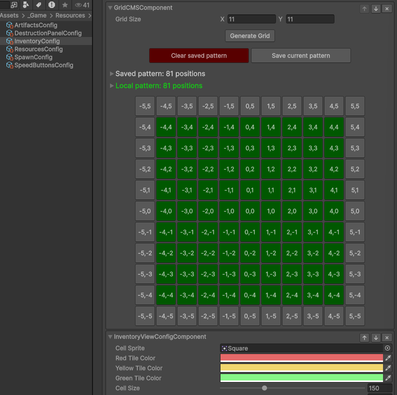
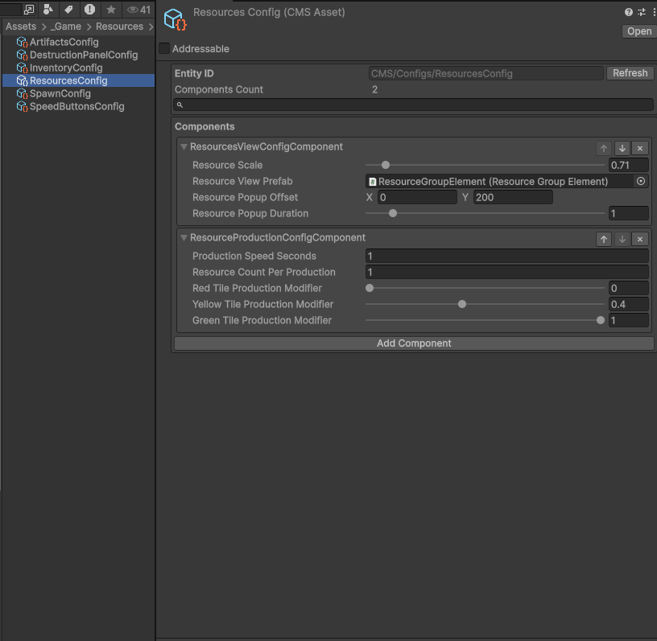
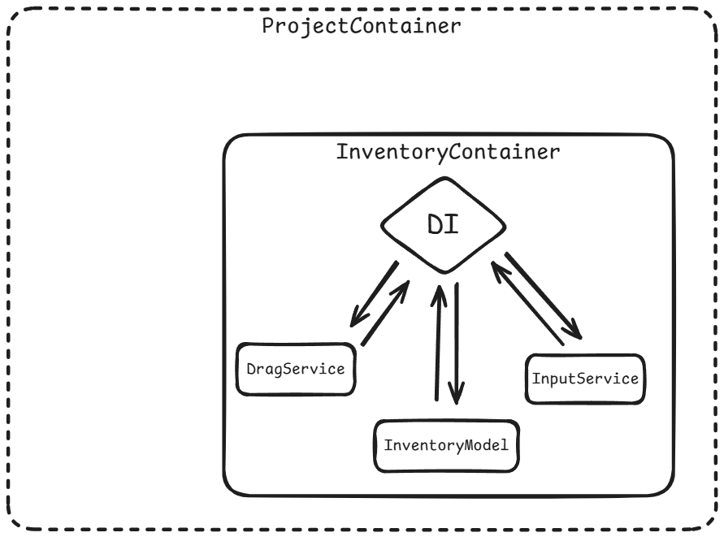
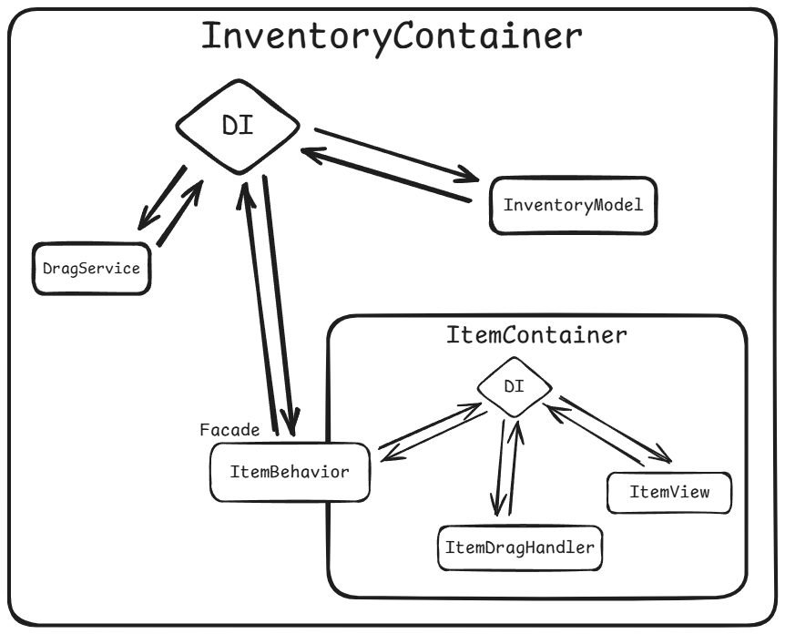
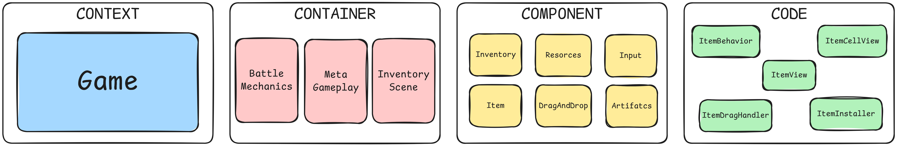
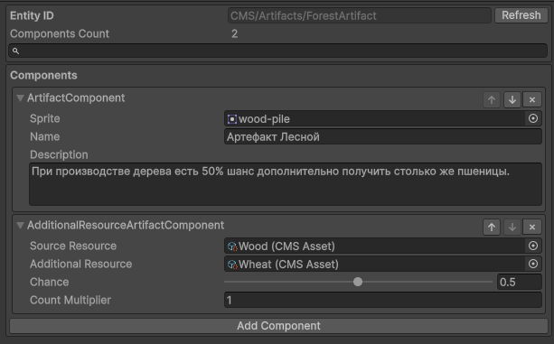
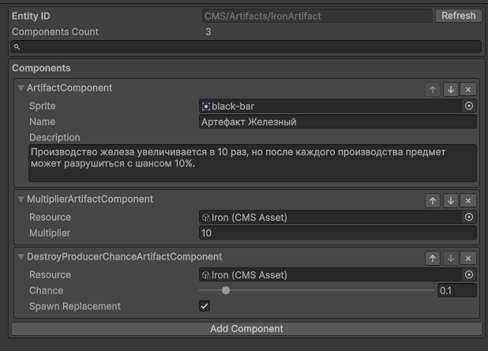
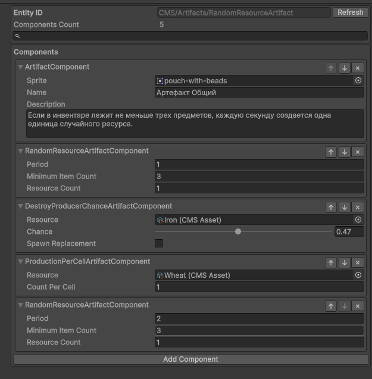
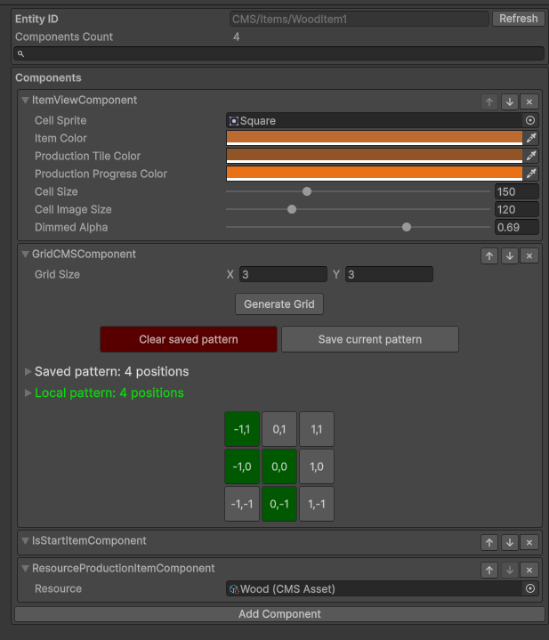
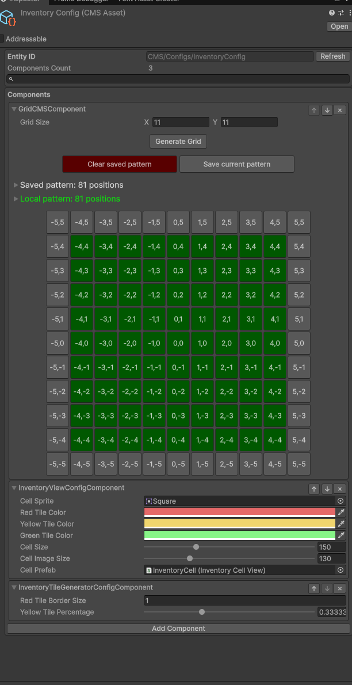

# Hypnohead Test Task

<br>

## Введение

<table>
  <tr>
    <td width="55%" valign="top">
      <p><strong>Версия Unity</strong></p>
      <p><code>6000.3.6f1</code></p>
      <p><strong>Основные элементы проекта</strong></p>
      <ul>
        <li><strong>Конфиги:</strong> <code>Assets/_Game/Resources/CMS/Configs</code></li>
        <li><strong>Скрипты:</strong> <code>Assets/_Game/Scripts</code></li>
        <li><strong>Основная сцена:</strong> <code>Assets/_Game/Scenes/InventoryScene.unity</code></li>
      </ul>
      <p><strong>Использованные пакеты</strong></p>
      <ul>
        <li><a href="https://github.com/Mathijs-Bakker/Extenject"><strong>Extenject 9.2.0</strong></a> - Dependency Injection, регистрация сервисов и сборка игрового контекста.</li>
        <li><a href="https://github.com/Cysharp/R3"><strong>R3 1.3.1</strong></a> - реактивные события, свойства и подписки между моделями, представлениями и игровыми сервисами.</li>
        <li><a href="https://github.com/Cysharp/ObservableCollections"><strong>ObservableCollections 3.3.4</strong></a> - реактивные коллекции для состояния инвентаря, ресурсов и артефактов с интеграцией в R3.</li>
        <li><a href="https://dotween.demigiant.com/getstarted.php"><strong>DOTween 1.3.030</strong></a> - анимация всплывающих уведомлений о полученных ресурсах.</li>
        <li><a href="https://docs.unity3d.com/Packages/com.unity.inputsystem@1.18/manual/index.html"><strong>Input System 1.18.0</strong></a> - обработка ввода.</li>
      </ul>
    </td>
    <td width="45%" valign="top">
      <p align="center">
        <br>
        <sub>Настройка сетки инвентаря</sub>
      </p>
      <p align="center">
        <br>
        <sub>Настройка производства ресурсов</sub>
      </p>
    </td>
  </tr>
</table>

<br>

## Использованные подходы

<br>

### Dependency Injection

Для внедрения зависимостей используется Zenject.

<p align="center">
  <br>
  <sub>Основной DI-контекст проекта</sub>
</p>

Например, `InventoryView` получает модель для чтения состояния и отдельный контракт для выполнения команд:

```csharp
[Inject]
private void Construct(InventoryModel model, IInventoryViewCommands commands)
{
    _model = model;
    _commands = commands;
}
```

Такой подход даёт несколько преимуществ:

- легко подменять и тестировать;
- класс не привязан к способу создания зависимостей;
- реализации можно заменить в точке регистрации;
- жизненный цикл сервисов контролируется контейнером.

Пример находится в [InventoryView](Assets/_Game/Scripts/Runtime/UI/Inventory/InventoryView.cs).

<br>

### Installer

`InventoryInstaller` выступает точкой сборки основного контекста игры. В нём регистрируются модели, сервисы, представления, обработчики, фабрики.

Регистрации разделены по смыслу, состав каждой подсистемы можно быстро найти в одном месте:

```csharp
public override void InstallBindings()
{
    InstallBootstrap();
    InstallInventory();
    InstallSpawnPanel();
    InstallDestructionPanel();
    InstallItemFactory();
    InstallServices();
    InstallResources();
    InstallTicks();
    InstallSpeedButtons();
    InstallArtifacts();
}
```

Способ регистрации зависит от типа объекта:

```csharp
Container.Bind<ResourcesModel>()
    .AsSingle();

Container.BindInterfacesAndSelfTo<ResourceProductionHandler>()
    .AsSingle();

Container.BindInterfacesAndSelfTo<InventoryView>()
    .FromInstance(_viewHost.InventoryView)
    .AsSingle();
```
Полная регистрация находится в [InventoryInstaller](Assets/_Game/Scripts/Runtime/Bootstrap/InventoryInstaller.cs).

<br>

### Subcontainer

Каждый предмет создаётся в отдельном суб-контайнере и передает API из фасада ItemBehavior. Родительский контейнер отвечает за фабрику, `ItemInstaller` собирает внутренние зависимости конкретного предмета.

<p align="center">
  <br>
  <sub>Связь родительского контейнера с контекстом отдельного предмета</sub>
</p>

Фабрика предметов в `InventoryInstaller`:

```csharp
Container.BindFactory<CMSEntity, RectTransform, ItemBehavior, ItemBehavior.Factory>()
    .FromSubContainerResolve()
    .ByNewContextPrefab<ItemInstaller>(_itemPrefab);
```

Внутри контекста `ItemInstaller` связывает скрывает внутренюю логику:

```csharp
Container.Bind<ItemBehavior>()
    .FromComponentOnRoot()
    .AsSingle();

Container.Bind<CMSEntity>()
    .FromInstance(_itemDataEntity)
    .AsSingle();

Container.Bind<ItemTriggerHandler>()
    .AsSingle();

Container.BindInterfacesAndSelfTo<ItemDragHandler>()
    .AsSingle();

Container.BindInterfacesAndSelfTo<ItemView>()
    .AsSingle();
```

В результате каждый предмет получает собственные экземпляры `ItemTriggerHandler`, `ItemDragHandler` и `ItemView`. Эти зависимости не смешиваются с обработчиками других предметов и уничтожаются вместе с его контекстом.

Реализация находится в [ItemInstaller](Assets/_Game/Scripts/Runtime/Items/ItemInstaller.cs) и [ItemBehavior.Factory](Assets/_Game/Scripts/Runtime/Items/ItemBehavior.cs).

<br>

### Инкапсуляция изменения состояния модели

`InventoryModel` хранит внутреннее состояние сетки. Методы `SetCell` и `RemoveCell` изменяют это состояние, но вызывать их должен только `InventoryView`, так как именно он создаёт и удаляет визуальные ячейки.

Операции изменения состояния вынесены в отдельный контракт:

```csharp
public interface IInventoryViewCommands
{
    public void SetCell(Vector2Int gridPosition, RectTransform item);
    public bool RemoveCell(Vector2Int gridPosition);
}
```

`InventoryModel` реализует контракт явно, методы не входят в публичный API модели:

```csharp
bool IInventoryViewCommands.RemoveCell(Vector2Int gridPosition)
{
    return _gridCells.Remove(gridPosition);
}

void IInventoryViewCommands.SetCell(Vector2Int gridPosition, RectTransform item)
{
    _gridCells[gridPosition] = item;
}
```

В контейнере контракт доступен только для `InventoryView`:

```csharp
Container.Bind<IInventoryViewCommands>()
    .To<InventoryModel>()
    .FromResolve()
    .WhenInjectedInto<InventoryView>();
```

`InventoryView` получает контракт отдельно от модели и вызывает его при создании или удалении ячейки:

```csharp
_commands.SetCell(gridPosition, cell.RectTransform);
_commands.RemoveCell(gridPosition);
```

В результате изменять связь координат с визуальными ячейками может только `InventoryView`. Остальной код получает `InventoryModel` без доступа к `SetCell` и `RemoveCell`.

Реализация находится в [IInventoryViewCommands](Assets/_Game/Scripts/Runtime/UI/Inventory/IInventoryViewCommands.cs), [InventoryModel](Assets/_Game/Scripts/Runtime/UI/Inventory/InventoryModel.cs) и [InventoryView](Assets/_Game/Scripts/Runtime/UI/Inventory/InventoryView.cs).

<br>

### Реактивный подход

R3 и ObservableCollections используются для передачи изменений состояния, пользовательского ввода и игрового времени. Системы реагируют на события и не вызывают ручное обновление зависимых объектов.

**Синхронизация Model и View**

Состояние хранится в реактивных коллекциях модели. View получает коллекции только для чтения и подписывается на конкретные типы изменений.

Например, `InventoryView` создаёт ячейку только после добавления позиции в `InventoryModel`:

```csharp
_model.GridPositions
    .ObserveAdd()
    .Select(eventData => eventData.Value)
    .Subscribe(AddCell)
    .AddTo(_disposable);
```

По такому же принципу `ResourcesView` реагирует на добавление, удаление и изменение количества ресурсов, а `ArtifactsView` обновляет артефакты, стоимость и состояние кнопки покупки. View не опрашивает модель в `Update` и не требует общего метода `Refresh`.

`ReactiveProperty` используется для одиночного состояния. `InventoryModel.PlacementPreview` передаёт текущее превью размещения, а `InventoryView` показывает или скрывает подсветку.

**Потоки событий**

`InputService` преобразует события Input System в `Observable`. Получатели подписываются на `OnRotateItem` и `SetSpeed`, не зависят от конкретных `InputAction` и не регистрируют обработчики ввода самостоятельно.

`TickService` создаёт общий поток игрового времени с учётом паузы и скорости:

```csharp
public Observable<float> OnTick => _onTick;

_tickService.OnTick
    .Subscribe(Tick)
    .AddTo(_disposable);
```

На этот поток подписаны производство ресурсов и периодические эффекты артефактов. Изменение скорости или пауза применяются в одном месте и не дублируются в каждой системе.

Примеры находятся в [InventoryView](Assets/_Game/Scripts/Runtime/UI/Inventory/InventoryView.cs), [ResourcesView](Assets/_Game/Scripts/Runtime/Resources/ResourcesView.cs), [InputService](Assets/_Game/Scripts/Runtime/Input/InputService.cs) и [TickService](Assets/_Game/Scripts/Runtime/Ticks/TickService.cs).

<br>

### Архитектурный подход и интерпретация C4

Модель C4 используется для разделения проекта по уровням ответственности и определения границ модулей.

<p align="center">
  <br>
  <sub>Интерпретация уровней C4 в проекте</sub>
</p>

- **Context** - игра целиком.
- **Container** - самостоятельная механика со своей сценой, DI-контейнером и точкой запуска.
- **Component** - отдельная система внутри механики: Inventory, Resources, Input, Item, DragAndDrop или Artifacts.
- **Code** - классы и обработчики, реализующие внутреннюю логику компонента.

Системы проектировались как заменяемые модули. На уровне Component каждый модуль имеет фасадный класс. Он предоставляет внешнее API и отвечает за взаимодействие с другими системами. Внутренние обработчики остаются на уровне Code и не используются снаружи напрямую.

**Item**

`ItemBehavior` выступает фасадом предмета. Внешние системы работают с ним, а `ItemView`, `ItemDragHandler` и `ItemTriggerHandler` скрыты внутри суб-контейнера. Фасад передаёт им команды через своё API:

```csharp
public void SetDimmed(bool isDimmed)
{
    _itemView.SetDimmed(isDimmed);
}
```

**Artifacts**

`ArtifactsModel` выступает фасадом системы артефактов. Он предоставляет методы `TryPurchase`, `CanPurchase` и `ProcessProduction`, а конкретные эффекты выполняются отдельными обработчиками через `IArtifactProductionHandler`, `IArtifactProductionModifierHandler` и `IArtifactAddedHandler`. Остальные системы не зависят от реализаций отдельных артефактов.

В текущем проекте Container определен сценой [InventoryScene](Assets/_Game/Scenes/InventoryScene.unity), её механикой, [InventoryInstaller](Assets/_Game/Scripts/Runtime/Bootstrap/InventoryInstaller.cs) и [InventoryBootstrap](Assets/_Game/Scripts/Runtime/Bootstrap/InventoryBootstrap.cs). Installer собирает зависимости, Bootstrap запускает системы контейнера.

Новая механика может быть добавлена как отдельный Container. Например, мета-геймплей или боевой модуль могут иметь собственные зависимости, DI-контейнер, Bootstrap и отдельную аддитивную сцену, если необходима. Взаимодействие с другими контейнерами сохраняется через публичные API их компонентов.

Примеры фасадов находятся в [ItemBehavior](Assets/_Game/Scripts/Runtime/Items/ItemBehavior.cs) и [ArtifactsModel](Assets/_Game/Scripts/Runtime/Artifacts/ArtifactsModel.cs).

<br>

## CMS - Content Management System

CMS - система конфигов, собираемых из компонентов. Каждый `CMSAsset` хранит набор независимых `CMSComponent`, которые определяют его данные и поведение.

<br>

### Гибкая конфигурация

Поведение сущности определяется набором компонентов. Конфиг может содержать все доступные компоненты, только часть из них или не содержать ни одного опционального компонента поведения.

Компоненты можно переиспользовать и комбинировать между разными сущностями. Это позволяет тасовать игровые механики без создания отдельного типа конфига под каждую комбинацию.

<table>
  <tr>
    <td width="33%" valign="top" align="center">
      <a href="Assets/_Game/Resources/CMS/Artifacts/ForestArtifact.asset">
        
      </a><br>
      <sub><a href="Assets/_Game/Resources/CMS/Artifacts/ForestArtifact.asset">ForestArtifact</a></sub>
    </td>
    <td width="33%" valign="top" align="center">
      <a href="Assets/_Game/Resources/CMS/Artifacts/IronArtifact.asset">
        
      </a><br>
      <sub><a href="Assets/_Game/Resources/CMS/Artifacts/IronArtifact.asset">IronArtifact</a></sub>
    </td>
    <td width="33%" valign="top" align="center">
      <a href="Assets/_Game/Resources/CMS/Artifacts/RandomResourceArtifact.asset">
        
      </a><br>
      <sub><a href="Assets/_Game/Resources/CMS/Artifacts/RandomResourceArtifact.asset">RandomResourceArtifact</a></sub>
    </td>
  </tr>
</table>

Обработчик проверяет наличие нужного компонента через `entity.Is<Component>`. Если компонента нет, сущность просто пропускается:

```csharp
if (!artifact.Is<AdditionalResourceArtifactComponent>(out var component))
    return;
```

Один артефакт может одновременно участвовать в нескольких механиках. Каждый обработчик отвечает только за свой компонент и не зависит от полного состава конфига.

Пример находится в [AdditionalResourceArtifactHandler](Assets/_Game/Scripts/Runtime/Artifacts/Handlers/AdditionalResourceArtifactHandler.cs).

<br>

### Редактор компонента

Для отдельного компонента можно определить собственный `PropertyDrawer` без изменения общего редактора CMS. Для `GridCMSComponent` сделан редактор, в котором паттерн сетки редактируется визуально:

```csharp
[CustomPropertyDrawer(typeof(GridCMSComponent.GridData))]
public sealed class GridCMSComponentEditor : PropertyDrawer
```

<p align="center">
  <a href="Assets/_Game/Resources/CMS/Items/WoodItem1.asset">
    
  </a><br>
  <sub><a href="Assets/_Game/Resources/CMS/Items/WoodItem1.asset">WoodItem1</a> с редактором GridCMSComponent</sub>
</p>

Редактор находится в [GridCMSComponentEditor](Assets/_Game/Scripts/Editor/GridCMSComponentEditor.cs).

<br>

### Один конфиг как директория

Компонентный подход позволяет использовать один конфиг как директорию для настроек одного архетипа. Связанные данные находятся в одном `CMSAsset`, но остаются логически разделены по компонентам.

[InventoryConfig](Assets/_Game/Resources/CMS/Configs/InventoryConfig.asset) объединяет:

- `GridCMSComponent` - конфигурацию сетки и бизнес-логики инвентаря.
- `InventoryViewConfigComponent` - конфигурацию визуала инвентаря.
- `InventoryTileGeneratorConfigComponent` - конфигурацию генератора ячеек.

Вместо нескольких разрозненных конфигов все настройки инвентаря находятся в одном месте. При этом каждый компонент остаётся самостоятельным и используется только своей системой.

<p align="center">
  <a href="Assets/_Game/Resources/CMS/Configs/InventoryConfig.asset">
    
  </a><br>
  <sub><a href="Assets/_Game/Resources/CMS/Configs/InventoryConfig.asset">InventoryConfig</a></sub>
</p>
